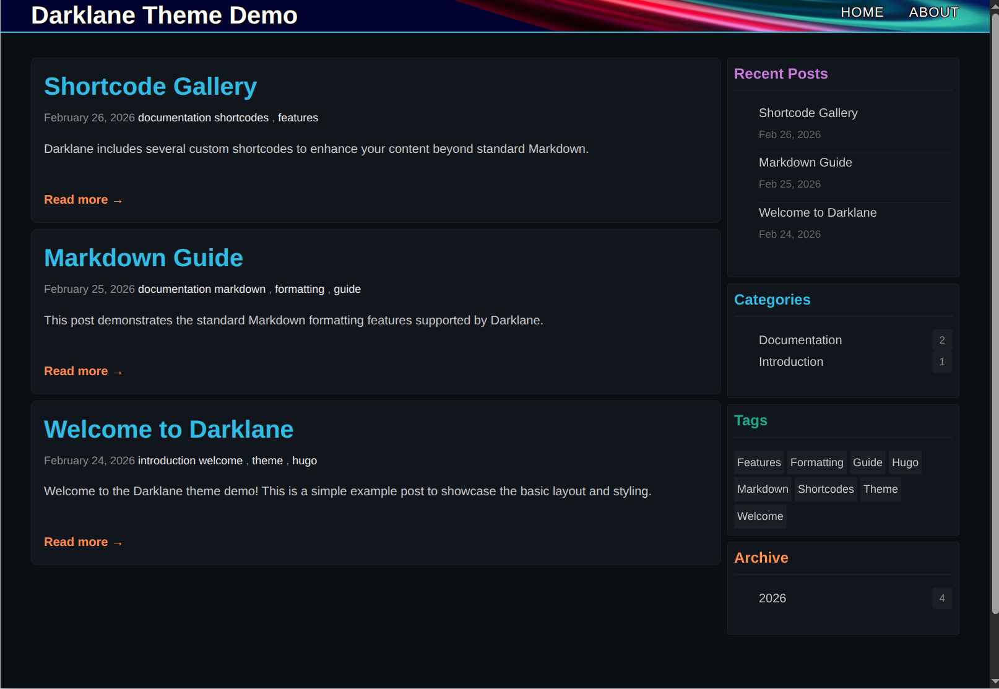

# Darklane

A clean, dark-themed Hugo blog template designed for technical writing and documentation.


## Features

- **Dark Color Scheme** - Easy on the eyes with carefully chosen accent colors
- **Syntax Highlighting** - Beautiful code blocks with support for multiple languages
- **Custom Shortcodes** - Alerts, highlights, collapsible sections, tabs, tables, and more
- **LaTeX Support** - Write mathematical expressions inline or as display equations
- **Responsive Design** - Works great on desktop and mobile devices
- **CSS Variables** - Easy color customization through centralized configuration
- **Clean Typography** - Optimized for long-form technical reading

## Demo



Check out the [example site](exampleSite/) to see all features in action.

## Installation

### As a Git Submodule (Recommended)

Navigate to your Hugo site directory and add the theme:

```bash
git submodule add https://github.com/hadella/darklane.git themes/darklane
```

Then add the theme to your `hugo.toml`:

```toml
theme = "darklane"
```

### As a Clone

```bash
cd themes
git clone https://github.com/hadella/darklane.git
```

## Configuration

Copy the example configuration from `exampleSite/hugo.toml` to your site's root directory and customize:

```toml
baseURL = "https://example.org/"
languageCode = "en-us"
title = "Your Site Title"
theme = "darklane"

paginate = 5

[markup]
  [markup.highlight]
    noClasses = false
  [markup.goldmark.renderer]
    unsafe = true

[params]
  author = "Your Name"
  description = "Your site description"
  recentPostsCount = 5
  defaultBanner = "/images/default-banner.jpg"

[menu]
  [[menu.main]]
    name = "Home"
    url = "/"
    weight = 1
  [[menu.main]]
    name = "About"
    url = "/about/"
    weight = 2
```

## Creating Content

### Posts

Create a new post:

```bash
hugo new posts/my-post-name/index.md
```

Add images to `posts/my-post-name/images/` to keep everything organized.

### Front Matter

```yaml
---
title: "Your Post Title"
date: 2025-02-26
categories: ["category"]
tags: ["tag1", "tag2"]
banner: "images/banner.jpg"  # Optional
---

Your intro paragraph here.

<!--more-->

Rest of your content...
```

The `<!--more-->` comment marks where the preview ends on list pages.

## Customization

### Colors

All theme colors are defined as CSS variables in `static/css/darklane.css`. Edit the `:root` section to customize:

```css
:root {
  --color-primary: #39BAE6;      /* Cyan */
  --color-secondary: #26a98b;    /* Green */
  --color-accent-1: #C678DD;     /* Magenta */
  --color-accent-2: #FF8F40;     /* Orange */
  --color-accent-3: #FFBF00;     /* Yellow */
  /* ... and more */
}
```

### Header Images

- **Title Banner**: Place `title-banner.png` in `static/images/` for the site header background
- **Post Banners**: Add banner images to each post's `images/` folder or set a default in config

## Shortcodes

Darklane includes several custom shortcodes:

### Alerts

```markdown

This is a warning message.

```

Types: `warning`, `info`, `note`, `error`, `important`

### Highlights

```markdown

This is important information.

```

Types: `tip`, `warning`, `success`, `error`, `important`

### Collapsible Details

```markdown

Hidden content here.

```

### Tab Groups

```markdown


\`\`\`python
print("Hello")
\`\`\`


\`\`\`javascript
console.log("Hello");
\`\`\`


```

### Images

```markdown

```

### Tables

```markdown


| Header 1 | Header 2 |
|----------|----------|
| Data 1   | Data 2   |


```

Colors: `primary`, `secondary`, `accent-1`, `accent-2`, `accent-3`

### YouTube

```markdown

```

## Header Colors

Add color to headers using CSS classes:

```markdown
## Colored Header {.text-primary}
## Another Color {.text-accent-2}
```

Available: `.text-primary`, `.text-secondary`, `.text-accent-1`, `.text-accent-2`, `.text-accent-3`, `.text-error`, `.text-bright`, `.text-dim`

## Development

To run the example site locally:

```bash
cd exampleSite
hugo server -D
```

## Requirements

- Hugo 0.112.0 or higher (extended version recommended)
- Git (for installation via submodule)

## License

This theme is released under the [MIT License](LICENSE).

## Credits

Created by [Justin Hadella](https://github.com/hadella)

## Contributing

Issues and pull requests are welcome! Please feel free to contribute.
